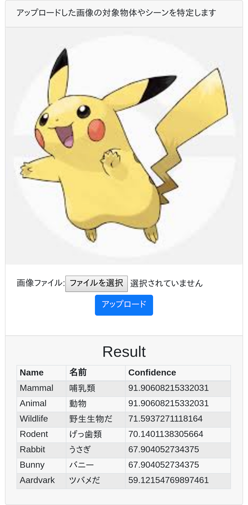

# django_img_recognition

## Description
Amazon Rekognitionを利用した画像認識が可能なPython/Django製のWebアプリケーション

## Requirement
* python 3.7
* pip
* pipenv
* docker
* docker-compose
* postgreSQL 10.10
* awscli (AWS CLI)
* ecs-cli (Amazon ECS CLI)

## Architecture Image


## Service Image


## Install
### ① ローカル
#### 1. git clone
```bash
$ git clone https://github.com/numasa/django_img_recognition.git
$ cd django_img_recognition/django
```
#### 2. pipenv install
```bash
$ pipenv install
```
#### 3. migrate & runserver
```bash
$ pipenv run python manage.py migrate --settings=django_img_recognition.settings.local
$ pipenv run python manage.py runserver --settings=django_img_recognition.settings.local
```
### ② ローカルDocker
#### 1. ローカルDockerからECRログイン
```bash
$ cd django_img_recognition/
$ $(aws ecr get-login --region {your_region} --no-include-email)
```
#### 2. 環境変数の情報を設定する
以下のファイルで利用するために、「.env」ファイルに環境変数を設定します。
* docker-compose.dev.yml
</br>
.envを以下の内容で作成
```bash
# AWS ECR パス
CONTAINER_REGISTRY_PATH="123456789012.dkr.ecr.region.amazonaws.com"
```
作成後に
```bash
$ export $(cat .env | grep -v ^# | xargs)
```

#### 3. ローカルDocker環境のbuild
```bash
$ docker-compose -f docker-compose.dev.yml build
```
#### 4. ローカルDocker環境のup
```bash
$ docker-compose -f docker-compose.dev.yml up
```
#### 5. ローカルDocker環境のアクセスURL
http://localhost/imgrecognition/upload/

#### 6. (停止する場合)ローカルDocker環境のdown
```bash
$ docker-compose -f docker-compose.dev.yml down
```

### ③ AWS Fargate
[InstallAWSFargate.md](/InstallAWSFargate.md)を参照

### CI/CD
AWS CodepipelineでCI/CDの流れを実現
#### CI/CDの流れ


#### Source


#### Build


#### Deploy

